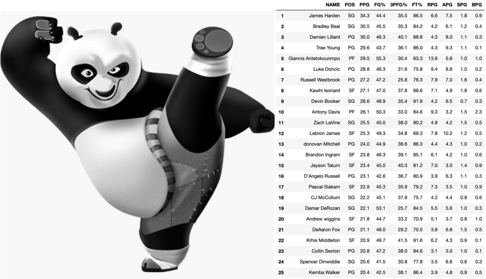

<font size = '5'><b>Manipulating DataFrames using Pandas</b><font>



This repository follows a first one that I created on Basic for DataFrame Manipulations using Pandas where I designed a workflow to illustrate some of the function/methods that I use the most through an exercise with stat from some of my favorite basketball players of all time. In this new one I will once again use basketball data but from the 2019-2020 season that just ended a couple of months ago. This time I will focus on the top 25 league scorers. 

The idea is the same as for the previous repository where I will guide the user through the entire exercise from creating a DataFrame from a dictionary through some slightly more advance Pandas methods. This will be a more intermediate level compared to the first one, but still not advance. I will concentrate on writing an advance one but through a project using real data in the coming weeks. 

The content that I will be working with is the following:

1. Creating a DataFrame from a dictionary
2. Configurations and Settings<br>
    2.1 max_rows & max_columns<br>
    2.2 precision<br>
    2.3 dimensions<br>
    2.4 max_colwidth<br>
3. Combining DataFrames<br>
    3.1 Concatenating<br>
    3.2 Merging<br>
    3.3 Appending<br>
4. Reshaping your dataFrame<br>
    4.1 Reshaping with Melt<br>
    4.2 Reshaping with transpose<br>
    4.3 Reshaping with Stacking and Unstaking<br>
5. Using the Datetime module<br>
6. Using the groupby() method/function<br>
7. Slicing DataFramess using .loc and .iloc

As with other repositories, I will try to update this one with any additional material that I can think of, but for the time being I will be concentrating on how to introduce the Advance one first.

Any feedback/comments are always welcome. You can reach me via my <a href="https://www.linkedin.com/in/jaherbas-ds-geophysicist/">Linkedin</a> or email (jaherbas@yahoo.ca). Also feel free to ask me to add anything that you would like to learn about related to Pandas and I will try my best to add it.


```python

```
